<h1 align="center"> Tối ưu hoá công việc trên Visual Code </h1>

<!-- banner -->
<div align="center">
  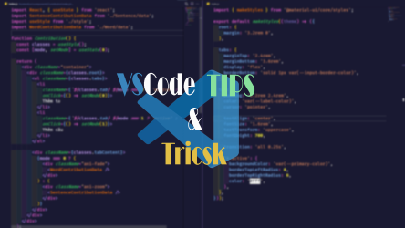
</div>

<!-- Mô tả -->
<br />

# 🥰 MÔ TẢ

> Sau thời gian làm việc với VSCode IDE thì mình tích góp được một vài cách làm việc nhanh hơn với IDE này. Dưới đây là tất cả những Extensions, Settings, Tips mà mình biết về VScode, mong rằng bài viết này sẽ giúp mọi người tối ưu hoá được công việc, cũng như tạo được nguồn cảm hứng khi làm việc trên IDE này nhé.
> Nếu thấy hay hãy thả cho mình một sao ⭐ nhé hehe 😉

<!-- Extensions -->
<br/>

# ⚒ Các Extension mình đã và đang dùng

<!-- Visual Studio IntelliCode -->
<details>
  <summary>
    1. Visual Studio IntelliCode
  </summary>

  <br/>

> Ext này hình như mặc định đã được cài thì phải. Còn nếu ae nào bị mất thì có thể cài lại nhé. Nó sẽ suggest code cho ae để ae code nhanh hơn.

<div align="center">
  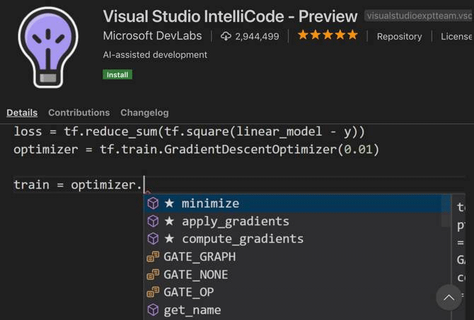
</div>

🔗 [Link tải Extension](https://marketplace.visualstudio.com/items?itemName=VisualStudioExptTeam.vscodeintellicode)

</details>

<!-- dracula theme -->
<details>
  <summary>
    2. Dracula Theme
  </summary>

<br />

> Nói về Dracula theme thì chắc đây cũng chính là theme quốc dân của bao ae coder đang dùng VScode nhỉ 😁. Đây là theme mình đang dùng, cách tuỳ chỉnh lại mình sẽ nói dưới phần cài đặt nhé 🤗

> Hoặc ae có thể tải bản đã setting sẵn của anh Trần Anh Tuấn Evondev nhé.

<div align="center">
  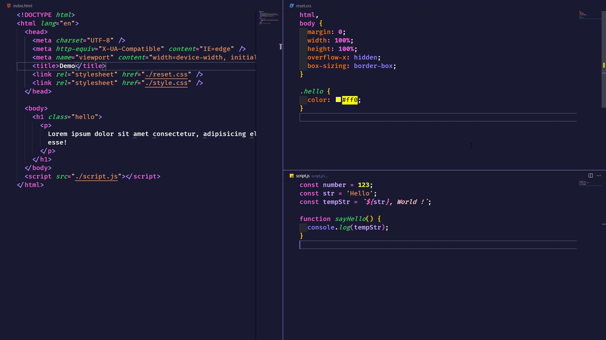
</div>

🔗 [Link tải bản gốc](https://marketplace.visualstudio.com/items?itemName=dracula-theme.theme-dracula)

🔗 [Link tải bản của Evondev](https://marketplace.visualstudio.com/items?itemName=evondev.dracula-high-contrast)

</details>

<!-- advanced new file -->
<details>
  <summary>
    3. Advanced-new-file
  </summary>
  <br/>

> Có bạn giờ bạn cảm thấy khó khăn khi phải tìm đến 1 thư mục con nằm trong thư mục con >> nằm trong thư mục con ... chỉ để tạo 1 file mới chưa? 😥 Nếu rồi thì đây chính là giải pháp cho ae đây 🙄 Extension "advanced-new-file" !

> Bạn chỉ cần dùng câu lệnh bằng cách bấm "Ctrl + Shift + P", Nhập câu command và chọn đường dẫn (Bạn chỉ cần nhập tắt, Ext sẽ giúp bạn đến đúng folder đó). Ngoài ra bạn có thể tạo folder bằng cách thêm "/" sau tên nhé.

> Còn muốn nhanh hơn thì xem phần cài đặt shorcut bên dưới nhé 😊

<div align="center">
  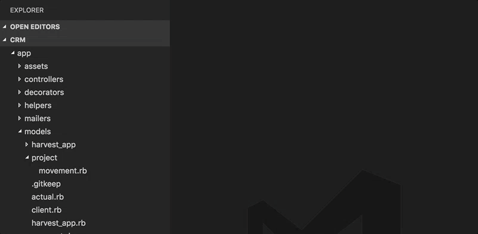
</div>

🔗 [Link tải Extension](https://marketplace.visualstudio.com/items?itemName=patbenatar.advanced-new-file)

</details>

<!-- file utils -->
<details>
  <summary>
    4. File Utils
  </summary>
  <br/>

> Cũng như ext trên, ext này giúp bạn có thể đổi tên file, xoá tên file ngay lập tức mà không cần tìm đến cây thư mục của VSCode nữa.

> Kết hợp với ext "advanced-new-file" thì bạn có thể bỏ luôn cây thư mục bên kia rồi hehe. Không cần dùng chuột như Vim luôn nè 😉

<div align="center">
  
</div>

🔗 [Link tải Extension](https://marketplace.visualstudio.com/items?itemName=sleistner.vscode-fileutils)

</details>

<!-- auto import -->
<details>
  <summary>
    5. Auto import
  </summary>

  <br/>

> Ext này sẽ giúp ae tự động tìm kiếm đường dẫn và import file. Nếu nó không tự động suggest thì ae có thể nhấn "Ctrl + Space" nhé.

🔗 [Link tải Extension](https://marketplace.visualstudio.com/items?itemName=steoates.autoimport)

</details>

<!-- auto rename tag -->
<details>
  <summary>
    6. Auto rename tag
  </summary>

  <br/>

> Ext này rất hữu ích cho ae Front-end. Khi cài đặt xong, ae chỉ cần sửa thẻ mở của 1 tag html (jsx) thì phần thẻ đóng cũng sẽ tự đổi theo 😗.

<div align="center">
  
</div>

🔗 [Link tải Extension](https://marketplace.visualstudio.com/items?itemName=formulahendry.auto-rename-tag)

</details>

<!-- Autoprefixer -->
<details>
  <summary>
    7. Autoprefixer
  </summary>

  <br/>

> Ext này giúp ae code css, sass tự thêm các prefix cho từng trình duyệt khác nhau (vd: --webkit-, --ms-). Chỉ cần khi code xong, ae chạy command "Autoprefixer"

<div align="center">
  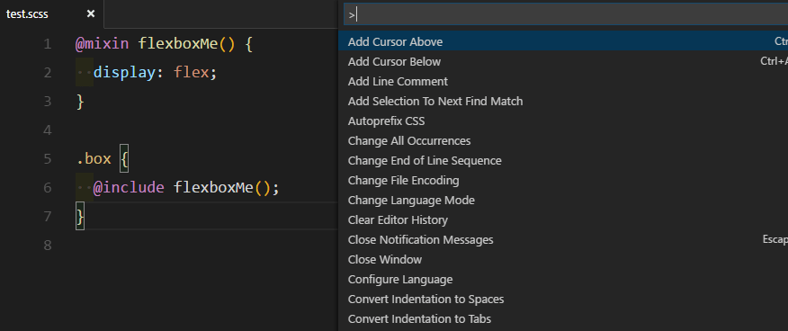
</div>

🔗 [Link tải Extension](https://marketplace.visualstudio.com/items?itemName=mrmlnc.vscode-autoprefixer)

</details>

<!-- Better comments -->
<details>
  <summary>
    8. Better comment
  </summary>
  <br/>

> Ext này giúp ae thay đổi màu comment dựa trên ý nghĩa của comment đó. Chỉ cần nhìn vào màu comment là biết ngay nó làm cái chi, có ý nghĩa gì 🤩

<div align="center">
  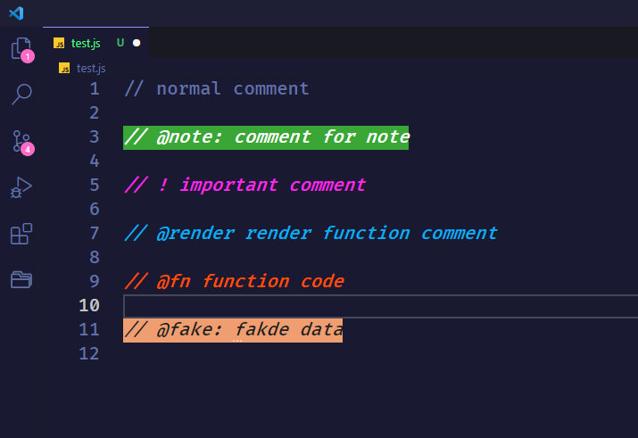
</div>

🔗 [Link tải Extension](https://marketplace.visualstudio.com/items?itemName=aaron-bond.better-comments)

</details>

<!-- Bracket Pair Colorizer -->
<details>
  <summary>
    9. Bracket Pair Colorizer 2
  </summary>

  <br/>

> Ext này giúp tự động thay đổi màu cho các cặp ngoặc, việc này giúp chúng ta dễ dàng nhận biết các scope khác nhau dựa trên màu sắc của chúng.

<div align="center">
  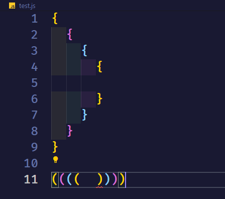
</div>

🔗 [Link tải Extension](https://marketplace.visualstudio.com/items?itemName=CoenraadS.bracket-pair-colorizer-2)

</details>

<!-- Code spell checker -->
<details>
  <summary>
    10. Code Spell Checker
  </summary>

  <br/>

> Người ta nói, một lý luận của bạn đều trở nên vô nghĩa nếu bạn sai "trính tã". Vì thế, đừng để ae chí cốt code chung chúng ta chửi chúng ta code ngu chỉ vì lỗi chính tả. Cài ngay Ext này để nó nhắc lỗi chính tả cho bạn.

<div align="center">
  
</div>

🔗 [Link tải Extension](https://marketplace.visualstudio.com/items?itemName=streetsidesoftware.code-spell-checker)

</details>

<!-- code highlight -->
<details>
  <summary>
    11. Code Highlight
  </summary>

  <br/>

> Ext sẽ giúp phát hiện ra những đoạn code có chưa mã màu và tô đúng màu đó cho bạn.

<div align="center">
  
</div>

🔗 [Link tải Extension](https://marketplace.visualstudio.com/items?itemName=naumovs.color-highlight)

</details>

<!-- 12. EditorConfig -->
<details>
  <summary>
    12. EditorConfig for VS Code
  </summary>

  <br/>

> Ext này sẽ giúp bạn tạo cái file trong dự án cùng một format với nhau, ví dụ như Spaces: 2, tab: 4, LF, trim_trailing_whitespace ... Kết hợp với file .editorconfig thì các người khác trong team cũng tuân theo quy tắc đó.

<div align="center">
  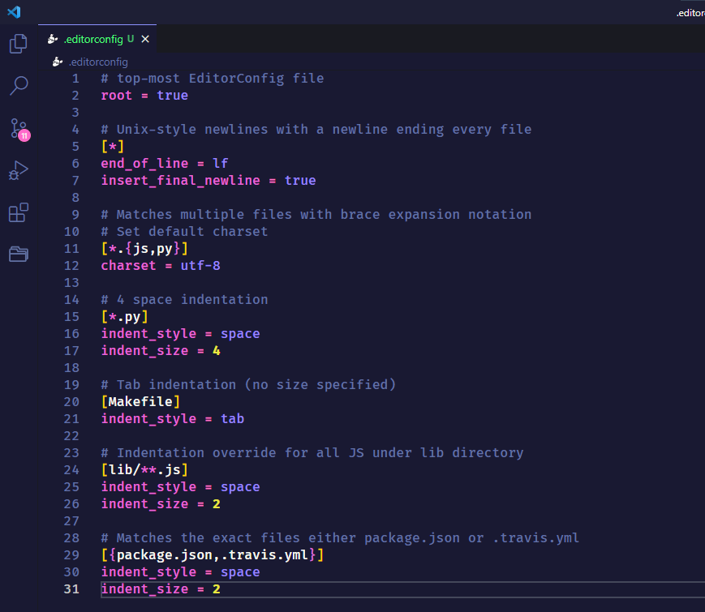
</div>

🔗 [Link tải Extension](https://marketplace.visualstudio.com/items?itemName=EditorConfig.EditorConfig)

</details>

<!-- 13. ESLint -->
<details>
  <summary>
    13. ESLint
  </summary>

  <br/>

> ESLint sẽ giúp chúng ta có thể tạo ra những quy tắc chung trong project, để code của tất cả các file được đồng nhất với nhau. Nó khác với Editorconfig ở chỗ là Editorconfig chỉ tạo những quy tắc về format code, định dạng file. Còn ESLint có thể tạo nhiều rule về code hơn.

🔗 [Link tải Extensionhttps://marketplace.visualstudio.com/items?itemName=dbaeumer.vscode-eslint

</details>

<!-- 14. Prettier -->
<details>
  <summary>
    14. Prettier - Code Formater
  </summary>

  <br/>

> Prettier là 1 trình Formater hoàn hảo, nó giúp chúng ta format code, auto format và đặc biệt là nó có thể kết hợp với các quy tắc của Editor config và ESLint để Format (Nhưng chúng ta phải câu hình chúng).

<div align="center">
  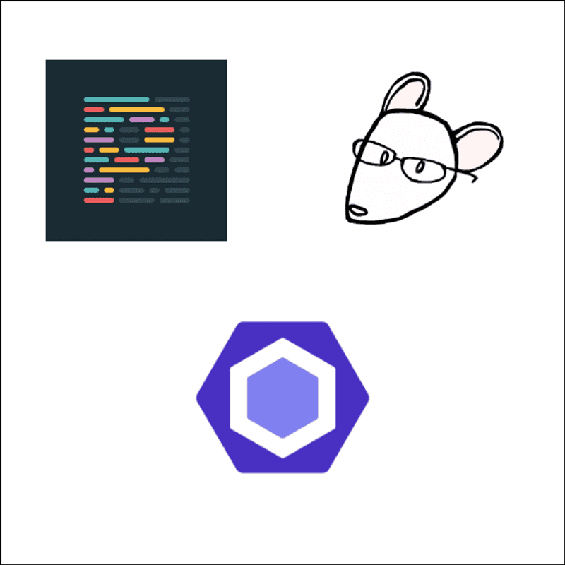
</div>

🔗 [Link tải Extension](https://marketplace.visualstudio.com/items?itemName=esbenp.prettier-vscode)

🔗 [Tìm hiểu thêm về Prettier](https://prettier.io/docs/en/options.html)

</details>

<!-- ES7 React/Redux/GraphQL/React Native Snippet  -->
<details>
  <summary>
    15. ES7 React/Redux/GraphQL/React Native Snippet  
  </summary>

  <br/>

> Bộ snippet hữu dụng cho React dev, giúp ae tạo bộ khung chương trình 1 cách nhanh chóng.

<div align="center">
  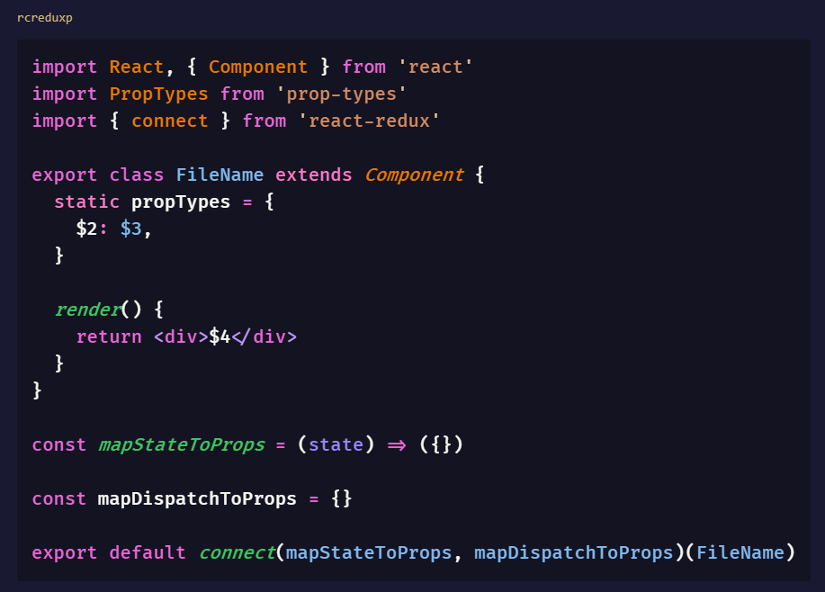
</div>

🔗 [Link tải Extension](https://marketplace.visualstudio.com/items?itemName=dsznajder.es7-react-js-snippets)

</details>

<!-- 16. Git Blame / Git History -->
<details>
  <summary>
    16. Git Blame / Git History / Git Lens
  </summary>

  <br/>

> 3 Exts Git Blame, Git History, Git Lens có chức năng khá tương đồng nhau. Nó giúp ae có thể xem đoạn lịch sử git trực tiếp tai dòng code đó, xem branch hiện tại, các thay đổi của file, merge file, ...

> Bản thân mình thì mình thích Git Blame hơn vì nó tối giản, gọn nhẹ hơn. Ae có thể thử cả 3 rồi chọn cho mình 1 cái ưng ý nhé 😋

<div align="center">
  
</div>

🔗 [Link tải Git Blame](https://marketplace.visualstudio.com/items?itemName=waderyan.gitblame)

🔗 [Link tải Git Lens](https://marketplace.visualstudio.com/items?itemName=eamodio.gitlens)

🔗 [Link tải Git History](https://marketplace.visualstudio.com/items?itemName=donjayamanne.githistory)

</details>

<!-- 17. Highlight Matching Tag -->
<details>
  <summary>
    17. Highlight Matching Tag
  </summary>

  <br/>

> Ext này giúp chúng ta tìm nhanh thẻ đóng của 1 thẻ mở bằng cách đưa con trỏ đến thẻ mở, Ext sẽ tự tìm thẻ đóng cho chúng ta. Ae cũng có thể custom lại màu highlight tuỳ thích.

<div align="center">
  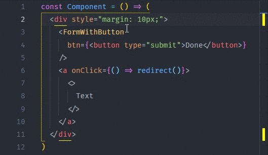
</div>

🔗 [Link tải Extension](https://marketplace.visualstudio.com/items?itemName=vincaslt.highlight-matching-tag)

</details>

<!-- 18. htmltagwrap -->
<details>
  <summary>
    18. htmltagwrap
  </summary>

  <br/>

> Như cái tên của nó, Ext này sẽ giúp ae wrap 1 cặp thẻ bao 1 đoạn code html (jsx) lại một cách nhanh chóng (mặt định là tổ hợp "Alt + W"). Thay vì ae phải viết 1 thẻ mở, rồi tìm đến cuối đoạn để đóng thẻ đó lại thì chỉ cần bôi đen đoạn code rồi bấm tổ hợp phím. Ae cũng có thể lựa chọn cặp thẻ để bao lại là thẻ gì.

<div align="center">
  
</div>

🔗 [Link tải Extension](https://marketplace.visualstudio.com/items?itemName=bradgashler.htmltagwrap)

</details>

<!-- 19. Indent-rainbow -->
<details>
  <summary>
    19. indent-rainbow
  </summary>

  <br/>

> Ext giúp tô màu cho các tab đầu dòng của chúng ta theo kiểu rainbow, giúp phân biệt các dòng code và scope code dễ dàng hơn.

<div align="center">
  
</div>

🔗 [Link tải Extension](https://marketplace.visualstudio.com/items?itemName=oderwat.indent-rainbow)

</details>

<!-- 20. JavaScript (ES6) code snippet -->
<details>
  <summary>
    20. JavaScript (ES6) code snippet
  </summary>

  <br/>

> Ae nào code Javascript thì chắc hẳn đều biết đến Ext này, bộ snippet cực hữu dụng cho code JS.

<div align="center">
  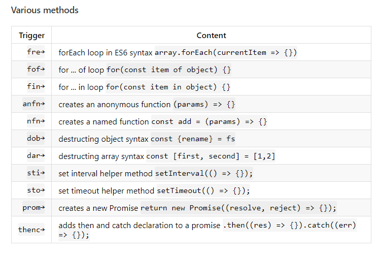
</div>

🔗 [Link tải Extension](https://marketplace.visualstudio.com/items?itemName=xabikos.JavaScriptSnippets)

</details>

<!-- 21. Live Server -->
<details>
  <summary>
    21. Live Server
  </summary>

  <br/>

> Live Server Ext sẽ giúp chúng ta tạo một hot reload server khi code html, css, js. Chỉ cần save lại là server sẽ tự reload và cập nhật lại trên browser.

<div align="center">
  
</div>

🔗 [Link tải Extension](https://marketplace.visualstudio.com/items?itemName=ritwickdey.LiveServer)

</details>

<!-- 22. Material Icon Theme / vscode-icons -->
<details>
  <summary>
    22. Material Icon Theme / vscode-icons
  </summary>

  <br/>

> 2 Ext này giúp ta thêm icon vào các thư mục, file bên cây thư mục của VSCode, giúp chúng ta dễ dàng phân biệt các file, folder với nhau.

<div align="center">
  
</div>

<br />

<div align="center">
  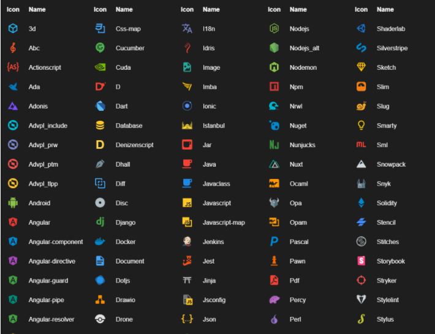
</div>

🔗 [Link tải Material Icon Theme](https://marketplace.visualstudio.com/items?itemName=PKief.material-icon-theme)

🔗 [Link tải vs-icons](https://marketplace.visualstudio.com/items?itemName=vscode-icons-team.vscode-icons)

</details>

<!-- 23. Path Intellisense -->
<details>
  <summary>
    23. Path Intellisense
  </summary>

  <br/>

> Ext này sẽ auto suggest đường dẫn khi bạn gõ đường dẫn.

<div align="center">
  
</div>

🔗 [Link tải Extension](https://marketplace.visualstudio.com/items?itemName=christian-kohler.path-intellisense)

</details>

<!-- 24. Project Manager -->
<details>
  <summary>
    24. Project Manager
  </summary>

  <br/>

> Ext này giúp ae lưu trữ các đường dẫn đến các thư mục chứa các project mà ae đang code. Vì thể, việc mở 1 project sẽ trở nên nhanh chóng hơn rất nhiều.

<div align="center">
  
</div>

🔗 [Link tải Extension](https://marketplace.visualstudio.com/items?itemName=alefragnani.project-manager)

</details>

<!-- 25. React PropTypes Generate -->
<details>
  <summary>
    25. React PropTypes Generate
  </summary>

  <br/>

> Nếu ae đang code React và dùng Proptype thì Ext này sẽ giúp ae tạo nhanh chóng proptype cho component.

<div align="center">
  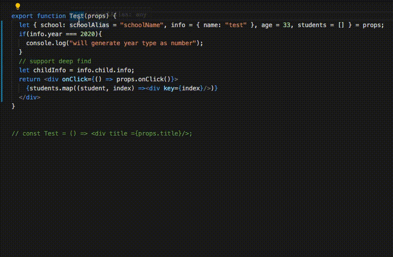
</div>

🔗 [Link tải Extension](https://marketplace.visualstudio.com/items?itemName=suming.react-proptypes-generate)

</details>

<!-- 26. REST Client -->
<details>
  <summary>
    26. REST Client
  </summary>

  <br/>

> Ext giúp chúng ta có thể test REST API dễ dàng chỉ với vài dòng code ngay trên VSCode mà không cần phải dùng đến Postman nữa.

<div align="center">
  
</div>

🔗 [Link tải Extension](https://marketplace.visualstudio.com/items?itemName=humao.rest-client)

</details>

<!-- 27. SCSS Formater -->
<details>
  <summary>
    27. SCSS Formater
  </summary>

  <br/>

> Ext giúp format code css và scss

<div align="center">
  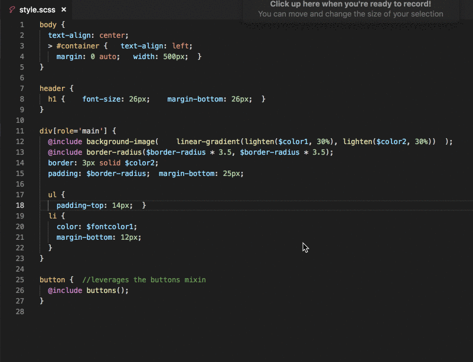
</div>

🔗 [Link tải Extension](https://marketplace.visualstudio.com/items?itemName=sibiraj-s.vscode-scss-formatter)

</details>

<!-- 28. Power Mode -->
<details>
  <summary>
    28. Power Mode
  </summary>

  <br/>

> Ext này sẽ tạo hiệU ứng khi ta viết code, giúp ae có cảm hứng làm việc hơn. Nhưng nó có thể gây chậm máy, lag nên ae cân nhắc. Buồn buồn hả bật lên 😎

<div align="center">
  
</div>

🔗 [Link tải Extension](https://marketplace.visualstudio.com/items?itemName=hoovercj.vscode-power-mode)

</details>

<!-- 29. Import cost -->
<details>
  <summary>
    29. Import cost
  </summary>

  <br/>

> Ext sẽ hiển thị size của các thư viện mà ae import vào, từ đó ae cân nhắc xem có nên thêm thư viện đó vào hay không.

🔗 [Link tải Extension](https://marketplace.visualstudio.com/items?itemName=wix.vscode-import-cost)

</details>

<!-- 30. Bookmarks -->
<details>
  <summary>
    30. Bookmarks
  </summary>

  <br/>

> Ext giúp chúng ta đặt các bookmark tại các dòng code cần lưu ý. Ext này đặc biết hữu dụng khi luồng code của chúng ta khá phức tạp, chia ở nhiều file. Khi Debug ta sẽ đánh dấu lại các dòng code đó.

<div align="center">
  
</div>

🔗 [Link tải Extension](https://marketplace.visualstudio.com/items?itemName=alefragnani.Bookmarks)

</details>

<!-- 31. Remote - WSL -->
<details>
  <summary>
    31. Setting Sync
  </summary>

  <br/>

> Sau khi cài đống extensions trên và những cài đặt ở dưới đây, thì chúng ta có thể lưu trữ nó trên Github Gist và dùng Setting Sync để đồng bộ lại. Trong trường hợp, phải dùng máy tính khác hoặc phải cài lại phần mềm thì Ext này sẽ giúp những cài đặt chúng ta không bị mất đi.

<div align="center">
  
</div>

🔗 [Link tải Extension](https://marketplace.visualstudio.com/items?itemName=Shan.code-settings-sync)

</details>

<!-- Bonus: Tabnine AI Code & GitHub Copilot -->
<details>
  <summary>
    Bonus: Tabnine AI Code & GitHub Copilot
  </summary>

  <br/>

> 2 thanh niên AI đang làm mưa làm gió hiện nay. Ae có thể tìm hiểu thêm nhé.

🔗 [Link tải Tabnine](https://marketplace.visualstudio.com/items?itemName=TabNine.tabnine-vscode)

🔗 [Link tải Github Copilot](https://marketplace.visualstudio.com/items?itemName=GitHub.copilot)

</details>

<!-- setting -->
<br />

# ⚙ Các cài đặt Visual Code

<!-- settings -->
<details>
  <summary>
    0. Hướng dẫn cài đặt với file settings.jon
  </summary>

  <br/>

> Cho ae nào chưa biết, thì ngoài cài đặt trực tiếp bằng GUI của VSCode, thì ae có thể sửa thằng trong file `settings.json`.

> Có 2 cách để mở file settings.json:

1. Vào phần cài đặt VSCode -> chọn `Open Setting (JSON)` bên gốc phải màn hình.

2. Mở command `Ctrl + Shf + P`, gõ `Open Setting (JSON)`.

</details>

<!-- Fira Font -->

<details>
  <summary>
    1. Fira Font và Font Ligatures
  </summary>

  <br/>

> Font chữ mà mình sử dụng là Fira font và font chữ có hõ trợ ligatures giúp chúng ta đọc code nhanh hơn.

<div align="center">
  
</div>

```json
"editor.fontFamily": "Fira Code",
"editor.fontLigatures": true
```

🔗 [Link tải Font](https://github.com/tonsky/FiraCode)

</details>

<!-- Zoom -->
<details>
  <summary>
    2. Zoom bằng chuột (Mouse Wheel Zoom)
  </summary>

  <br/>

> Cài đặt này giúp ae phóng to, thu nhỏ font chữ bằng chuột.

```json
"editor.mouseWheelZoom": true
```

</details>

<!-- Format on save -->
<details>
  <summary>
    3. Format
  </summary>

  <br/>

> Lưu lại khi save (Format on Save)

```json
"editor.formatOnSave": true
```

> Chọn trình format mặc đỊnh (default formatter)

```json
Cấu trúc > "[ngôn ngữ]": {
  	"editor.defaultFormatter": "trình format"
}

Ví dụ:
"[javascript]": {
		"editor.defaultFormatter": "esbenp.prettier-vscode"
},
"[scss]": {
		"editor.defaultFormatter": "sibiraj-s.vscode-scss-formatter"
}
```

> Một vài cài đặt Prettier

```json
"prettier.singleQuote": true, // Sử dụng dấu nháy đơn
"prettier.jsxSingleQuote": true, // Sử dụng dấu nháy đơn cho thuộc tính trong jsx
"autoprefixer.formatOnSave": true, // Format on Save
"prettier.trailingComma": "all", // Thêm dấu phẩy vào phần tử cuối của Object
"prettier.useTabs": true, // Dùng tab thay vì space
```

</details>

<!-- Emmet -->
<details>
  <summary>
    4. Emmet cho ngôn ngữ khác
  </summary>

  <br/>

> Emmet bộ snippet giúp ae Front-end code html nhanh hơn. VD: `.box` = `<div class="box"></div>`. Mặc định, ta chỉ có thể dùng trong file html. Với cài đặt này, ae có thể dùng ở các file khác.

```json
"emmet.includeLanguages": {
  "javascript": "javascriptreact", // dành cho file jsx
  "markdown": "html"
},
```

</details>

<!-- Custom VSCode -->
<details>
  <summary>
    5. Custom giao diện VSCode
  </summary>

  <br/>

> Ae có thể thay đổi mọi màu sắc trong IDE một cách tuỳ thích, chỉ cần ae hiều thuộc tính cần thay đổi là gì.

```json
// Thay đổi màu sắc IDE
"workbench.colorCustomizations": {
  "sideBar.background": "#191932",
  "editor.background": "#191932",
  // ...
},

// Một vài cài đặt khác
"workbench.activityBar.visible": true, // Bật tắt thanh sidebar bên trái
"workbench.colorTheme": "Dracula", // Cài đặt theme
"window.menuBarVisibility": "toggle", // Tắt thanh menu trên cùng (Giữ Alt và Click để hiện thanh menu)
```

🔗 [Link tìm hiểu thêm API VSCode](https://code.visualstudio.com/api/references/theme-color)

</details>

<!-- custom editor theme -->
<details>
  <summary>
    6. Custom theme
  </summary>

  <br/>

> Ae có thể tuỳ ý thay đổi các màu của bất kỳ theme nào, chỉ cần ae biết tý về Css.

```json
Cấu trúc

"editor.tokenColorCustomizations": {
  "[Tên theme]": {
    "textMateRules": [
      {
        "scope": [Mảng các scope],
        "settings": {
          Các thuộc tính style
        }
      },
    ]
  }
}
```

```json
Ví dụ:
"editor.tokenColorCustomizations": {
  "[Dracula]": {
    "textMateRules": [
      {
        "scope": ["string.quoted", "string.quoted.single"],
        "settings": {
          "foreground": "#d38a60",
          "fontStyle": "italic"
        }
      },
    ]
  }
}
```

> Cách lấy tên các scope

> B1: Mở command `Ctrl + Shf + P`, gõ "Inspect Editor Tokens and Scopes"

<div align="center">
  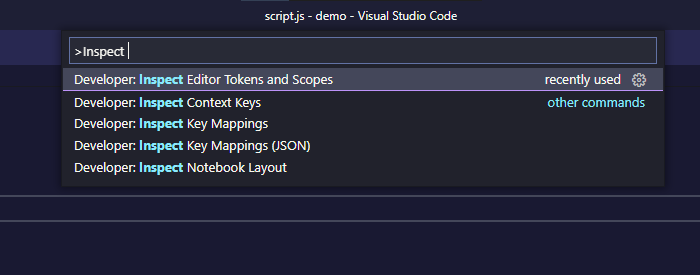
</div>

> B2: Click chuột vào vị trí mà ae muốn đổi màu, và copy tên thuộc tính.

<div align="center">
  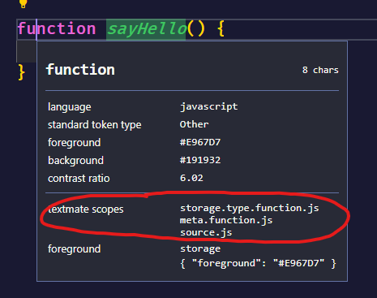
</div>

</details>

<!-- Better comment -->
<details>
  <summary>
    7. Better comment
  </summary>

  <br/>

> Thêm màu sắc để phân biệt các comment với nhau.

<div align="center">
  
</div>

```json
"better-comments.tags": [
  {
    "tag": "@render", // prefix trước mỗi comment
    "color": "#06AEED",
    "strikethrough": false,
    "underline": false,
    "backgroundColor": "transparent",
    "bold": false,
    "italic": true
  },

  // ...
]
```

</details>

<!-- html wrap -->
<details>
  <summary>
    8. html wrapper
  </summary>

  <br/>

> Custom htmlwrapper extension

```json
"htmltagwrap.tag": "div", // tag mặc định sẽ wrap
"htmltagwrap.autoDeselectClosingTag": true, // tự động phát hiện kết thúc tag
```

</details>

<!-- exclude file -->
<details>
  <summary>
    9. Ẩn bớt folder, file (Exclude Folder, Files)
  </summary>

  <br/>

> Có một số folder và file rất ít khi chúng ta cần mở lên xem như node_modules, hay các file lock... Chúng ta có thể ẩn nó đi bên thanh sidebar để thư mục đỡ rối hơn.

```json
"files.exclude": {
  "**/.git": true,
  "**/.next": true,
  "**/.svn": true,
  "**/.hg": true,
  "**/CVS": true,
  "**/.DS_Store": true,
  "**/node_modules/": true,
  // ...
},
```

</details>

<!-- Other -->
<details>
  <summary>
    10. Một vài cài đặt khác
  </summary>

  <br/>

- Chọn terminal mặc định khi mở

```json
"terminal.integrated.shell.windows": "C:\\Windows\\System32\\cmd.exe",
```

- Auto save (Hạn chế liệt phím Ctrl + S)

```json
"files.autoSave": "afterDelay",
"files.autoSaveDelay": 2000 // Tự lưu sau 2s
```

</details>

<br />

# 🐱‍👤 Snippet

> 🐣 Snippet là những đoạn code ngắn thay thế cho những đoạn code có một mẫu chung, được lặp đi lặp lại. Sử dụng quen với các snippet thì ae sẽ giảm được rất nhiều thời gian khi code.

> Ngoài những snippet có sẵn do các Extension hỗ trợ, ae hoàn toàn có thể tạo ra những snippet cho riêng mình một cách dễ dàng.

- B1: Mở cài đặt góc phải, chọn `User Snippet` hoặc dùng tổ hợp phím `Ctrl+U Ctrl+S`.

- B2: Chọn loại snippet (có 2 loại là `Local` chỉ dùng cho dự án hiện tại và `Global` là cho mọi dự án).

- B3: Thêm 1 snippet theo cấu trúc như vd sau:

```json
"Make Arrow Function": { // Tên Snippet
  "prefix": "fn", // Cụm thay thế mà ae sẽ gõ
  "body": [
    // những gì cần thay thế
    "const ${1:name} = function(${2:params}){",
    "  $3",
    "  return $4;",
    "}"
  ],
  "description": "Make Arrow Function"
},
```

> 📝`$1` là thứ tự vị trí con trỏ sẽ di chuyển đến khi ae nhấn tab. `${1:default}` Cũng thế nhưng có default value

> 🐣 Ae có thể snippet generator website để tạo snippet nhanh chóng nhé.

🔗 [Link Snippet Generator](https://snippet-generator.app/)

# ⌨ Các shortcut hữu dụng trong Visual Code

## ⚙ Default Shortcut

| Key           |                                Mô tả                                 |                 Command                  |                                           Ghi chú |
| :------------ | :------------------------------------------------------------------: | :--------------------------------------: | ------------------------------------------------: |
| Ctrl+K Ctrl+S |                           Mở bảng Shortcut                           |          openGlobalKeybindings           |                                              \_\_ |
| Ctrl+P        |                     Mở navigation tìm file nhanh                     |    quickOpenNavigateNextInFilePicker     |                                     Nhập tên file |
| Ctrl+R        |                    Mở navigation tìm folder nhanh                    | quickOpenNavigateNextInRecentFilesPicker |                                     Nhập tên file |
| Ctrl+`        |                          Mở Terminal (cmd)                           |         terminal.toggleTerminal          |                                              \_\_ |
| Ctrl+Shf+C    |                     Mở Terminal (cmd) bên ngoài                      |        terminal.openNativeConsole        |           Mở terminal của máy và đến project root |
| Ctrl+Space    |                              Nhắc lệnh                               |              triggerSuggest              |                                              \_\_ |
| Ctrl+Shf+P    |                           Mở bảng command                            |  quickOpenNavigatePreviousInFilePicker   |                                      Nhập command |
| PageUp        |                       Đưa con trỏ về đầu file                        |               cursorPageUp               |                                              \_\_ |
| PageDown      |                       Đưa con trỏ về cuối file                       |              cursorPageDown              |                                              \_\_ |
| Home          |                       Đưa con trỏ về đầu dòng                        |                cursorHome                |                                              \_\_ |
| End           |                       Đưa con trỏ về cuối dòng                       |                cursorEnd                 |                                              \_\_ |
| Ctrl+G        |                      Di chuyển đến dòng bất kỳ                       |                 gotoLine                 |                                      Nhập số dòng |
| Ctrl+Shf+K    |                             Xoá một dòng                             |               deleteLines                |                                              \_\_ |
| Ctrl+C        |                           Copy (Copy dòng)                           |           clipboardCopyAction            |                       Copy dòng không cần bôi đen |
| Ctrl+X        |                            Cắt (Cắt dòng)                            |            clipboardCutAction            |                        Cắt dòng không cần bôi đen |
| Ctrl+L        |                        Bôi đen dòng hiện tại                         |           expandLineSelection            |                                              \_\_ |
| Shf+[⬆ ⬇ ⬅ ➡] |                    Chọn liên tiếp dòng hoặc ký tự                    | cursor[Row or Column]Select[Navigation]  |                                              \_\_ |
| Alt+Shf+[⬇ ⬆] |              Copy&Paste một dòng lên trên hoặc bên dưới              |       copyLines[Navigation]Action        |                   Có thể copy 1 đoạn được bôi đen |
| Alt+[⬇ ⬆]     |                   Di chuyển 1 dòng lên hoặc xuống                    |       moveLines[Navigation]Action        |                                              \_\_ |
| Ctrl+K Ctrl+L |                  Thu gọn hoặc mở rộng một đoạn code                  |            editor.toggleFold             |                                              \_\_ |
| Ctrl+D        | Tìm kiếm các từ trùng với ký tự tại con trỏ và thêm 1 con trỏ tại đó |       addSelectionToNextFindMatch        |                                Bôi đen hoặc không |
| Ctrl+Shf+L    |          Chọn tất cả các ký tự trùng và thêm con trỏ tại đó          |             selectHighlights             | Không phân biệt hoa thường (Bôi đen) và ngược lại |
| F2            |                    Đổi tên 1 phương thức, 1 biến                     |                  rename                  |           Thay đổi tất cả chỗ nào có dùng biến đó |
| Ctrl+F or F3  |                   Tìm kiếm và tìm kết quả kế tiếp                    |           nextMatchFindAction            |                                              \_\_ |
| Ctrl+H        |                               Thay thế                               |          startFindReplaceAction          |                                              \_\_ |
| Ctrl+B        |                       Đóng mở Sidebar bên trái                       |         toggleSidebarVisibility          |                                              \_\_ |
| Ctrl+/        |          Tạo hoặc xoá 1 comment hoặc comment dòng hiện tại           |               commentLine                |                   Tạo multiple nếu bôi nhiều dòng |
| Shf+Tab       |                              Lùi 1 tab                               |                 outdent                  |                                 Ngược lại với tab |
| Ctrl+U Ctrl+S |                         Mở hoặc tạo Snippet                          |               openSnippets               |                                              \_\_ |
| Ctrl+,        |                             Mở settings                              |               openSettings               |                                              \_\_ |
